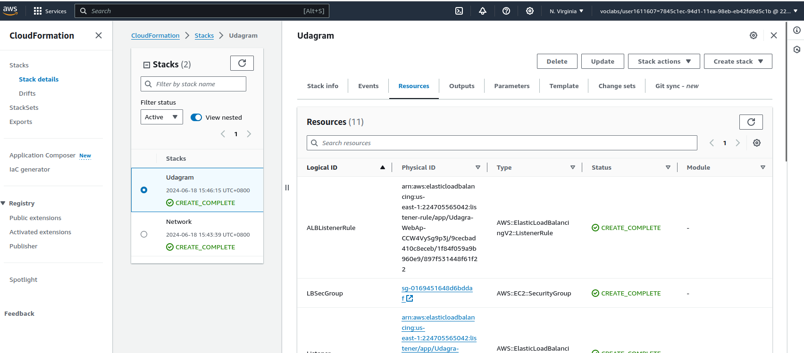

# CD12352 - Infrastructure as Code Project Solution
Deploy Infrastructure as Code by Jonathan

## Spin up instructions
The folder hierarchy.
```
.
├── delete_stack.sh
├── network_create.sh
├── network-parameters.json
├── network.yml
├── README.md
├── screenshots
│   ├── IaC_1_deploy.png
│   ├── IaC_2_network.png
│   ├── IaC_3_server.png
│   ├── IaC_4_lb.png
│   ├── IaC_5_url.png
│   ├── IaC_6_delete.png
│   └── IaC_7_image.png
├── server_create.sh
├── udagram-parameters.json
└── udagram.yml

1 directory, 15 files

```

First, to configure your aws
```
aws configure
```

Input the `AWS Access Key ID`, `AWS Secret Access Key`, `Default region name`, `Default output format`.

Once it's done, check it by using `aws configure list`. The output would be similar like below:
```
      Name                    Value             Type    Location
      ----                    -----             ----    --------
   profile                <not set>             None    None
access_key     ****************N4GC shared-credentials-file    
secret_key     ****************lDbZ shared-credentials-file    
    region                us-east-1      config-file    ~/.aws/config
```

If you're using the cloud session, you will also need to configure `AWS Session Token`:
```
aws configure set aws_session_token <your-aws-session-token>
```

To have the network up, run the following commands:
```
./network_create.sh Network network.yml network-parameters.json
``` 

The output shall be something like:
```
{
    "StackId": "arn:aws:cloudformation:us-east-1:224705565042:stack/Network/f9e484e0-2d3e-11ef-ac74-125519c19b95"
}
```

To have the Udagram server up, run the following commands:
```
./server_create.sh Udagram udagram.yml udagram-parameters.json
```

Again, the output shall be something like:
```
{
    "StackId": "arn:aws:cloudformation:us-east-1:224705565042:stack/Udagram/76174200-2d3f-11ef-a706-121177715239"
}
```





## Tear down instructions
To tear down the resources.

First to delete the server stack by:
```
./delete_stack.sh Udagram
```

After that, delete the network stack by:
```
./delete_stack.sh Network
```


## Other considerations
To specify the cloud image id, navigate to https://cloud-images.ubuntu.com/locator/.

Here's what we use for Amazon AWS.


Check the Network stack:
```
aws cloudformation list-stack-resources --stack-name Network
```

The example output:
```
{
    "StackResourceSummaries": [
        {
            "LogicalResourceId": "DefaultPrivateRoute1",
            "PhysicalResourceId": "rtb-04472ce8b351f814f|0.0.0.0/0",
            "ResourceType": "AWS::EC2::Route",
            "LastUpdatedTimestamp": "2024-06-18T06:51:46.558000+00:00",
            "ResourceStatus": "CREATE_COMPLETE",
            "DriftInformation": {
                "StackResourceDriftStatus": "NOT_CHECKED"
            }
        },
        {
            "LogicalResourceId": "DefaultPrivateRoute2",
            "PhysicalResourceId": "rtb-0ed8847e78cd1eb70|0.0.0.0/0",
            "ResourceType": "AWS::EC2::Route",
            "LastUpdatedTimestamp": "2024-06-18T06:51:56.848000+00:00",
            "ResourceStatus": "CREATE_COMPLETE",
            "DriftInformation": {
                "StackResourceDriftStatus": "NOT_CHECKED"
            }
        },
        {
            "LogicalResourceId": "DefaultPublicRoute",
            "PhysicalResourceId": "rtb-023c17870f3dfc127|0.0.0.0/0",
            "ResourceType": "AWS::EC2::Route",
            "LastUpdatedTimestamp": "2024-06-18T06:50:26.587000+00:00",

``` 

Check the Udagram server stack:
```
aws cloudformation list-stack-resources --stack-name Udagram
```

The example output:
```
{
    "StackResourceSummaries": [
        {
            "LogicalResourceId": "ALBListenerRule",
            "PhysicalResourceId": "arn:aws:elasticloadbalancing:us-east-1:224705565042:listener-rule/app/Udagra-WebAp-Epl4ulsUK9dr/404cd8067ef87249/391b0927e266b205/40f5e6e1979ac2e0",
            "ResourceType": "AWS::ElasticLoadBalancingV2::ListenerRule",
            "LastUpdatedTimestamp": "2024-06-18T06:56:11.294000+00:00",
            "ResourceStatus": "CREATE_COMPLETE",
            "DriftInformation": {
                "StackResourceDriftStatus": "NOT_CHECKED"
            }
        },
        {
            "LogicalResourceId": "LBSecGroup",
            "PhysicalResourceId": "sg-0372ed7e40657f8a6",
            "ResourceType": "AWS::EC2::SecurityGroup",
            "LastUpdatedTimestamp": "2024-06-18T06:53:32.079000+00:00",
            "ResourceStatus": "CREATE_COMPLETE",
            "DriftInformation": {
                "StackResourceDriftStatus": "NOT_CHECKED"
            }
        },
        {
            "LogicalResourceId": "Listener",
            "PhysicalResourceId": "arn:aws:elasticloadbalancing:us-east-1:224705565042:listener/app/Udagra-WebAp-Epl4ulsUK9dr/404cd8067ef87249/391b0927e266b205",
```
